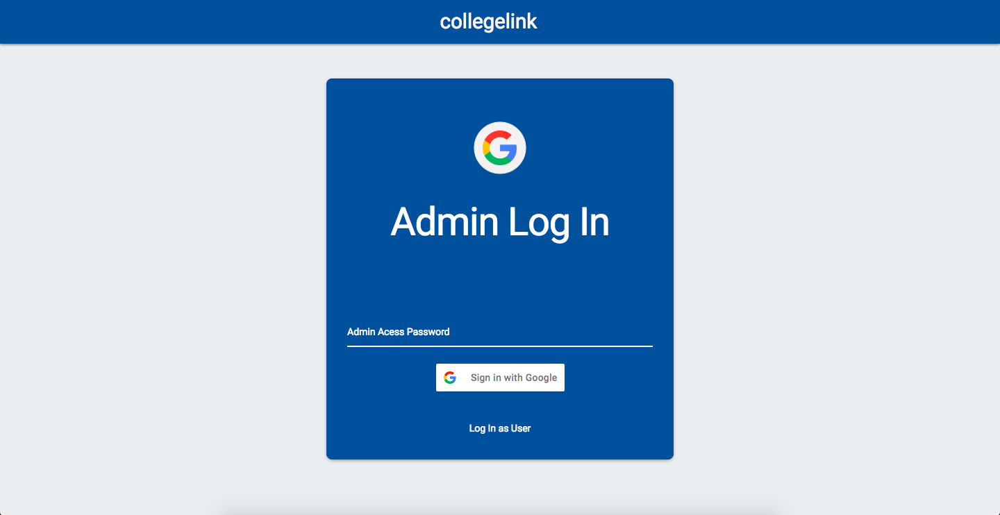
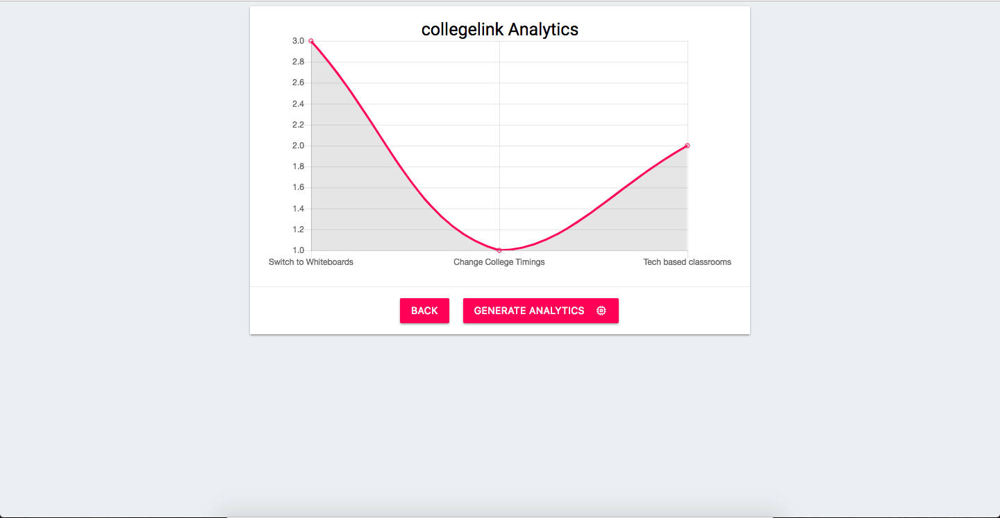

# College Suggestions Website #

*This is my first attempt at making a wesite using Angular and Firebase*

The project aims to make an intuitive website to bridge the gap between the administration and the students. The website works on suggestions and upvotes. Students are provided with a space where they will be able to send in their concerns and suggestions which will then be displayed anonymously on the homepage. Graphs are generated which are used to analyse the popularity of posts. This is a rather simple functioning website, however it helped be understand Angular and its functioning.

### Technologies Used ###
1. Angular         = https://angular.io
2. Firebase        = http://firebase.google.com
3. AngularFire     = https://github.com/angular/angularfire2
4. Charts.js       = https://www.chartjs.org
5. Materialize CSS = http://materializecss.com/

### Screens ###
#### Login Demo ####

#### Charts Demo ####

#### Post Demo ####

### Acknowledgements ###
* Thanks to @sohaamutsaddi for handling the documentation
* This idea was inspired by the genearl lack of communication between the Management and students of Educational Institues 

